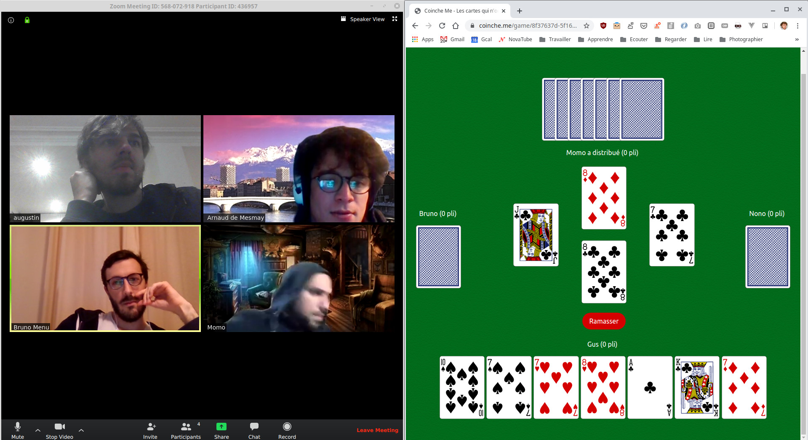

# A propos de [Coinche.me](https://coinche.me)

## Philosophie

L'objectif de Coinche.me est de permettre de jouer entre amis à la coinche le plus simplement possible, c'est-à-dire sur n'importe quel device, sans inscription, avec juste un lien d'invitation à partager.

## Comment jouer ?

Dans sa version actuelle, [Coinche.me](https://coinche.me) ne gère que le jeu de la carte. Cela signifie qu'il est nécessaire d'accompagner le jeu d'une communication vocale ou vidéo.

Si vous n'avez pas d'idée, nous recommandons https://meet.infomaniak.com qui permet aussi de démarrer un appel vidéo à plusieurs sans aucune inscription, en accord donc avec la philosophie de [Coinche.me](https://coinche.me).

[Coinche.me](https://coinche.me) est compatible sur tous les supports (ordinateur, tablette, smartphone), il y a donc plusieurs manières de s'organiser pour jouer :

1. **Recommandé** : sur un ordinateur, l'écran partagé entre la vidéo d'un coté et le jeu de l'autre.

2. Le jeu sur le téléphone et la vidéo sur l'ordinateur

3. Le jeu sur le téléphone et un système vocal pour jouer (ex: appel [WhatsApp](https://www.whatsapp.com))

## Qui a fait ça ?

[Augustin Riedinger](https://augustin-riedinger.fr/) et [Gautier Bayle](https://www.linkedin.com/in/gautierbayle).

Nous trouvions qu'en cette période de confinement, il manquait d'un moyen simple de jouer avec ses amis, sans passer des heures à inscrire tout le monde, installer les applis et à se retrouver sur une autre plateforme.

## Une suggestion, un retour, un bug ?

Vous pouvez nous écrire ici : https://augustin-riedinger.fr/fr/contact

Ou bien si vous souhaitez contribuer activement, le code source est disponible sur github : https://github.com/augnustin/coincheur. Il utilise nodejs, socketio, react et redis.

Bonne coinche !